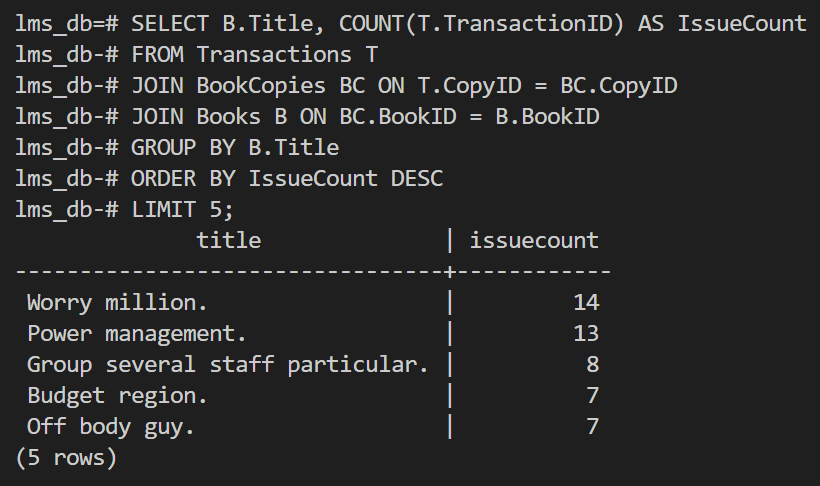
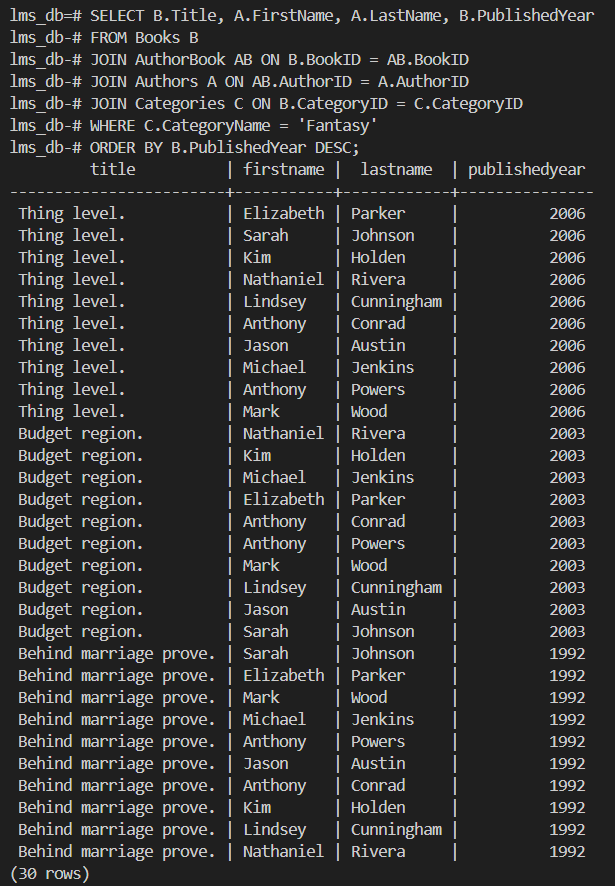
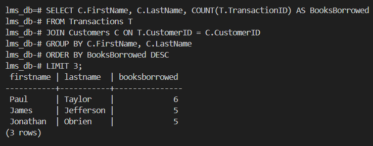
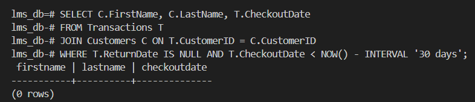
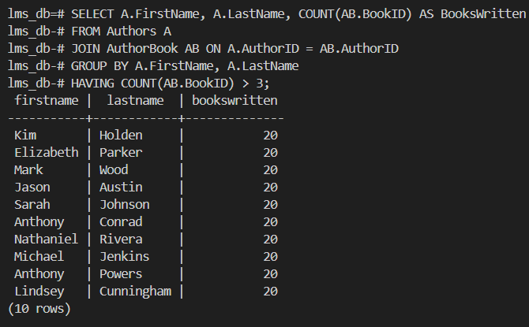
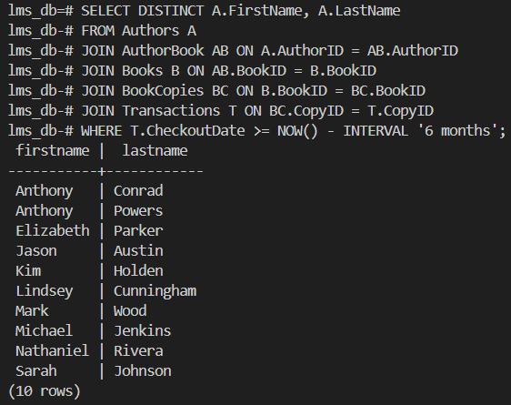
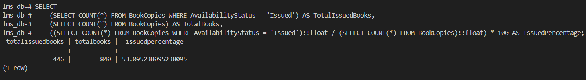
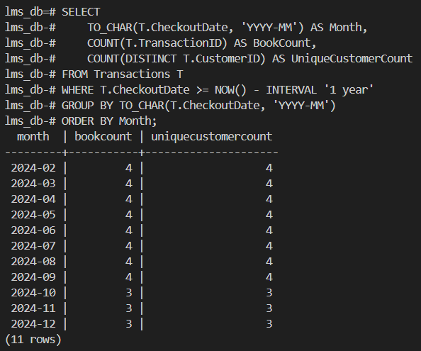
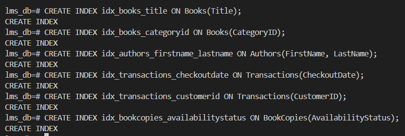

# Library Management System Documentation

## Schema Design

The schema for the library management system is designed to handle essential components for managing a library. The database supports functionalities such as:

- Book cataloging
- Tracking book availability
- Author contributions
- Customer transactions
- Category-based organization
## ER-DIAGRAM :

## Tables and Relationships

### Categories
- **Attributes:**
  - `CategoryID` (Primary Key, int): Unique identifier for each category.
  - `CategoryName` (string): Name of the book category (e.g., Fantasy, Science Fiction).
- **Purpose:** Categorizes books for easier organization and searching.

### Authors
- **Attributes:**
  - `AuthorID` (Primary Key, int): Unique identifier for each author.
  - `FirstName` (string): Author's first name.
  - `LastName` (string): Author's last name.
  - `BirthYear` (int): Year of birth of the author.
- **Purpose:** Maintains details about authors.

### Books
- **Attributes:**
  - `BookID` (Primary Key, int): Unique identifier for each book.
  - `Title` (string): Title of the book.
  - `ISBN` (string): Unique International Standard Book Number.
  - `CategoryID` (Foreign Key): Links to the Categories table.
  - `PublishedYear` (int): Year the book was published.
  - `Publisher` (string): Name of the publisher.
- **Purpose:** Maintains details about books in the library.

### AuthorBook
- **Attributes:**
  - `AuthorID` (Primary Key, Foreign Key): Links to the Authors table.
  - `BookID` (Primary Key, Foreign Key): Links to the Books table.
- **Purpose:** Handles many-to-many relationships between authors and books.

### Customers
- **Attributes:**
  - `CustomerID` (Primary Key, int): Unique identifier for each customer.
  - `FirstName` (string): Customer's first name.
  - `LastName` (string): Customer's last name.
  - `Email` (string): Customer's email address (unique).
  - `Phone` (string): Customer's contact number.
  - `Address` (string): Customer's address.
  - `MembershipDate` (date): Date the customer joined the library.
- **Purpose:** Maintains details about library customers.

### BookCopies
- **Attributes:**
  - `CopyID` (Primary Key, int): Unique identifier for each book copy.
  - `BookID` (Foreign Key): Links to the Books table.
  - `LibraryLocation` (string): Location of the book copy within the library.
  - `AvailabilityStatus` (string): Indicates whether the book is "Available" or "Issued."
- **Purpose:** Tracks the physical copies of books and their availability status.

### Transactions
- **Attributes:**
  - `TransactionID` (Primary Key, int): Unique identifier for each transaction.
  - `CustomerID` (Foreign Key): Links to the Customers table.
  - `CopyID` (Foreign Key): Links to the BookCopies table.
  - `CheckoutDate` (date): Date the book was checked out.
  - `ReturnDate` (date): Date the book was returned.
  - `Fine` (float): Fine amount, if any, for late returns.
- **Purpose:** Tracks book transactions, including checkouts, returns, and fines.

### Relationships
- **Categories — Books:** One-to-many relationship; each book belongs to one category.
- **Authors — Books (via AuthorBook):** Many-to-many relationship; a book can have multiple authors, and an author can write multiple books.
- **Books — BookCopies:** One-to-many relationship; each book can have multiple physical copies.
- **Customers — Transactions:** One-to-many relationship; each customer can make multiple transactions.
- **BookCopies — Transactions:** One-to-one relationship; each transaction is linked to one book copy.

## SQL queries to handle the following business insights:

### 1: Retrieve the top 5 most-issued books with their issue count.

``` sql 
SELECT B.Title, COUNT(T.TransactionID) AS IssueCount
FROM Transactions T
JOIN BookCopies BC ON T.CopyID = BC.CopyID
JOIN Books B ON BC.BookID = B.BookID
GROUP BY B.Title
ORDER BY IssueCount DESC
LIMIT 5;
```
#### Output :

### 2: List books along with their authors that belong to the "Fantasy" genre, sorted by publication year in descending order.

```sql 
SELECT B.Title, A.FirstName, A.LastName, B.PublishedYear
FROM Books B
JOIN AuthorBook AB ON B.BookID = AB.BookID
JOIN Authors A ON AB.AuthorID = A.AuthorID
JOIN Categories C ON B.CategoryID = C.CategoryID
WHERE C.CategoryName = 'Fantasy'
ORDER BY B.PublishedYear DESC;
```
#### Output :

### 3: Identify the top 3 customers who have borrowed the most books.

``` sql
SELECT C.FirstName, C.LastName, COUNT(T.TransactionID) AS BooksBorrowed
FROM Transactions T
JOIN Customers C ON T.CustomerID = C.CustomerID
GROUP BY C.FirstName, C.LastName
ORDER BY BooksBorrowed DESC
LIMIT 3;
```
#### Output :

### 4: List all customers who have overdue books (assume overdue if ReturnDate is null and IssueDate is older than 30 days).


``` sql
SELECT C.FirstName, C.LastName, T.CheckoutDate
FROM Transactions T
JOIN Customers C ON T.CustomerID = C.CustomerID
WHERE T.ReturnDate IS NULL AND T.CheckoutDate < NOW() - INTERVAL '30 days';
```
#### Output :

### 5: Find authors who have written more than 3 books.


``` sql
SELECT A.FirstName, A.LastName, COUNT(AB.BookID) AS BooksWritten
FROM Authors A
JOIN AuthorBook AB ON A.AuthorID = AB.AuthorID
GROUP BY A.FirstName, A.LastName
HAVING COUNT(AB.BookID) > 3;
```
#### Output :

### 6: Retrieve a list of authors who have books issued in the last 6 months.


``` sql
SELECT DISTINCT A.FirstName, A.LastName
FROM Authors A
JOIN AuthorBook AB ON A.AuthorID = AB.AuthorID
JOIN Books B ON AB.BookID = B.BookID
JOIN BookCopies BC ON B.BookID = BC.BookID
JOIN Transactions T ON BC.CopyID = T.CopyID
WHERE T.CheckoutDate >= NOW() - INTERVAL '6 months';
```
#### Output :


### 7. Calculate the total number of books currently issued and the percentage of books issued compared to the total available.


``` sql
SELECT 
    (SELECT COUNT(*) FROM BookCopies WHERE AvailabilityStatus = 'Issued') AS TotalIssuedBooks,
    (SELECT COUNT(*) FROM BookCopies) AS TotalBooks,
    ((SELECT COUNT(*) FROM BookCopies WHERE AvailabilityStatus = 'Issued')::float / (SELECT COUNT(*) FROM BookCopies)::float) * 100 AS IssuedPercentage;
```
#### Output :

### 8. Generate a monthly report of issued books for the past year, showing month, book count, and unique customer count.


``` sql
SELECT 
    TO_CHAR(T.CheckoutDate, 'YYYY-MM') AS Month, 
    COUNT(T.TransactionID) AS BookCount,
    COUNT(DISTINCT T.CustomerID) AS UniqueCustomerCount
FROM Transactions T
WHERE T.CheckoutDate >= NOW() - INTERVAL '1 year'
GROUP BY TO_CHAR(T.CheckoutDate, 'YYYY-MM')
ORDER BY Month;
```
#### Output :


### 9: Add appropriate indexes to optimize queries.


``` sql
CREATE INDEX idx_books_title ON Books(Title);
CREATE INDEX idx_books_categoryid ON Books(CategoryID);
CREATE INDEX idx_authors_firstname_lastname ON Authors(FirstName, LastName);
CREATE INDEX idx_transactions_checkoutdate ON Transactions(CheckoutDate);
CREATE INDEX idx_transactions_customerid ON Transactions(CustomerID);
CREATE INDEX idx_bookcopies_availabilitystatus ON BookCopies(AvailabilityStatus);
```
#### Output :

### 10:Analyze query execution plans for at least two queries using EXPLAIN and write your understanding from execution query plan in your words.


Here's an example of how to analyze the query execution plan:

#### Query 1: Top 5 most-issued books

- **EXPLAIN ANALYZE**
``` sql
SELECT B.Title, COUNT(T.TransactionID) AS IssueCount
FROM Transactions T
JOIN BookCopies BC ON T.CopyID = BC.CopyID
JOIN Books B ON BC.BookID = B.BookID
GROUP BY B.Title
ORDER BY IssueCount DESC
LIMIT 5;
```

- **Analysis**: The query planner will show the steps taken to execute the query, including the join operations, grouping, and sorting. The `LIMIT` clause will limit the number of rows returned to 5. Look for the total execution time and cost to identify any performance bottlenecks.


#### Query 2: Authors with books issued in the last 6 months

- **EXPLAIN ANALYZE**
``` sql
SELECT DISTINCT A.FirstName, A.LastName
FROM Authors A
JOIN AuthorBook AB ON A.AuthorID = AB.AuthorID
JOIN Books B ON AB.BookID = B.BookID
JOIN BookCopies BC ON B.BookID = BC.BookID
JOIN Transactions T ON BC.CopyID = T.CopyID
WHERE T.CheckoutDate >= NOW() - INTERVAL '6 months';
```

- **Analysis**: The query planner will show the join operations and filtering steps. The use of DISTINCT ensures that duplicate author records are removed. The query execution plan will help identify the cost and time taken for each operation, which can be useful for optimizing performance.
