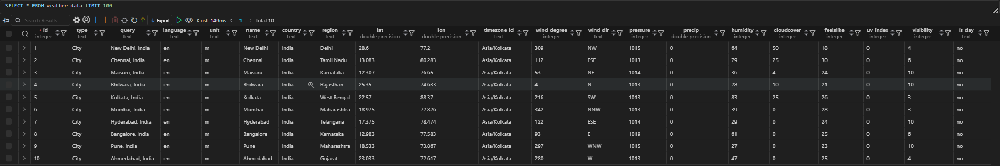
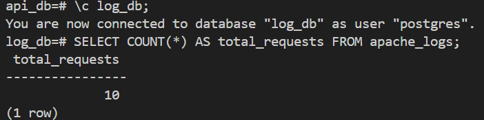
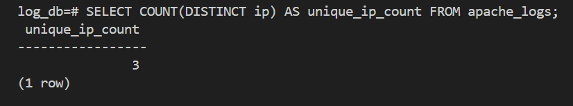
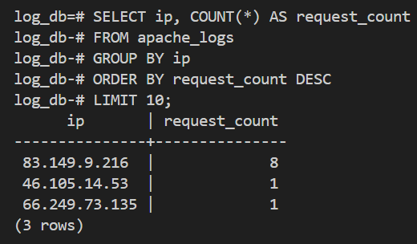
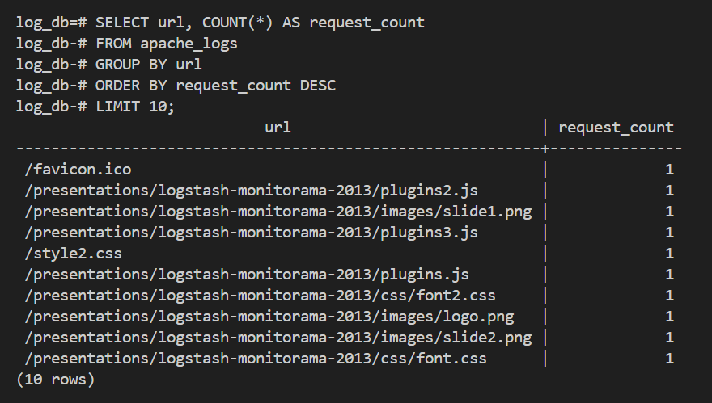
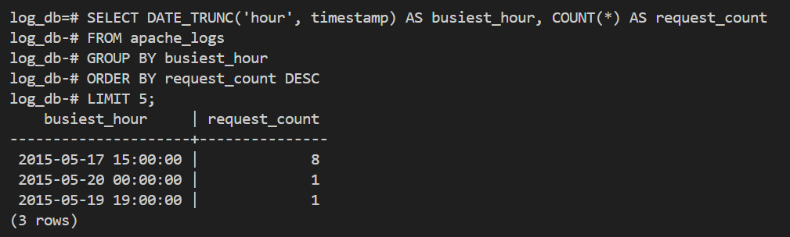
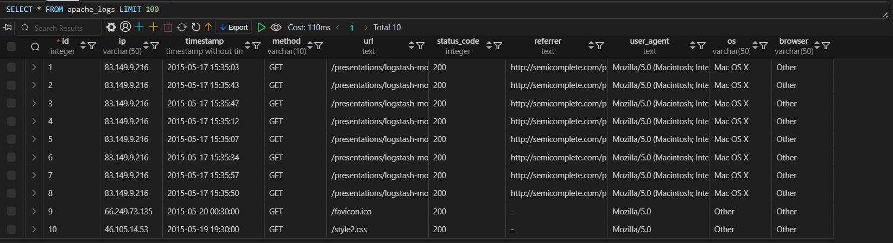

# Python Assignment

## Objective
The objective of this assignment is to design and implement Python solutions using various libraries such as `requests`, `psycopg2`, and more. The solutions will focus on structured coding, performance optimization, and best practices. The final implementation should be submitted via a pull request in your GitHub branch.

---

## Scenario 1: API Data Extraction and Loading into PostgreSQL

### Task Overview
- Select an API from [Public APIs](https://github.com/public-apis/public-apis)
- Implement a Python solution to extract data from the chosen API
- Load the extracted data into a PostgreSQL database
- Follow best practices for structuring the code using classes and methods

### Steps to Implement
1. **Set up the Environment**
   - Install dependencies: `pip install requests psycopg2`
   - Set up PostgreSQL and create a database
   
2. **Design the Python Script**
   - Use the `requests` library to fetch data from the API
   - Parse and transform the data as needed
   - Use `psycopg2` to connect to PostgreSQL and insert the data

3. **Example Implementation**
```python
import requests
import psycopg2

def fetch_data():
    url = "https://api.publicapis.org/entries"  # Example API
    response = requests.get(url)
    return response.json()

def insert_into_db(data):
    conn = psycopg2.connect("dbname=mydb user=myuser password=mypassword host=localhost")
    cursor = conn.cursor()
    insert_query = "INSERT INTO apis (title, description, category) VALUES (%s, %s, %s)"
    for entry in data["entries"]:
        cursor.execute(insert_query, (entry["API"], entry["Description"], entry["Category"]))
    conn.commit()
    cursor.close()
    conn.close()

data = fetch_data()
insert_into_db(data)
```

### Expected Output
- API data successfully stored in the PostgreSQL database

---

## Scenario 2: Apache Web Server Log Parser

### Task Overview
- Implement a parser for Apache web server logs
- Extract relevant information such as IP addresses, timestamps, HTTP methods, URL paths, status codes, browsers, and OS
- Load extracted data into a PostgreSQL database
- Implement SQL queries to generate reporting metrics

### Steps to Implement
1. **Set up Environment**
   - Install dependencies: `pip install pandas psycopg2 user-agents`
   - Download sample logs from [Apache Log Samples](https://github.com/elastic/examples/blob/master/Common%20Data%20Formats/apache_logs/apache_logs)

2. **Design the Log Parser**
   - Read log file line by line
   - Use regular expressions to extract required fields
   - Store the parsed data into a structured format
   
3. **Example Implementation**
```python
import re
import psycopg2
from datetime import datetime
from user_agents import parse

class ApacheLogParser:
    def __init__(self, log_file):
        self.log_file = log_file
        self.data = []

    def parse_logs(self):
        log_pattern = r'(?P<ip>\S+) - - \[(?P<timestamp>.*?)\] "(?P<method>\S+) (?P<url>\S+) \S+" (?P<status_code>\d+) \S+ "(?P<referrer>.*?)" "(?P<user_agent>.*?)"'
        with open(self.log_file, 'r') as file:
            for line in file:
                match = re.match(log_pattern, line)
                if match:
                    user_agent = parse(match.group('user_agent'))
                    timestamp = datetime.strptime(match.group('timestamp'), "%d/%b/%Y:%H:%M:%S %z")
                    self.data.append({
                        'ip': match.group('ip'),
                        'timestamp': timestamp,
                        'method': match.group('method'),
                        'url': match.group('url'),
                        'status_code': int(match.group('status_code')),
                        'referrer': match.group('referrer'),
                        'user_agent': match.group('user_agent'),
                        'os': user_agent.os.family,
                        'browser': user_agent.browser.family
                    })
        return self.data
```

4. **SQL Queries for Analysis**
    
    a) Total Number of Requests
    ```sql
    SELECT COUNT(*) AS total_requests FROM apache_logs;
    ```
    


    b) Number of Unique IP Addresses
    ```sql
    SELECT COUNT(DISTINCT ip) AS unique_ip_count FROM apache_logs;
    ```
    


    c) Top 10 Most Frequent IP Addresses
    ```sql
    SELECT ip, COUNT(*) AS request_count FROM apache_logs
    GROUP BY ip ORDER BY request_count DESC LIMIT 10;
    ```
    


    d) Top 10 Most Requested URL Paths
    ```sql
    SELECT url, COUNT(*) AS request_count FROM apache_logs
    GROUP BY url ORDER BY request_count DESC LIMIT 10;
    ```
    


    e) Busiest Hour of the Day
    ```sql
    SELECT EXTRACT(HOUR FROM timestamp) AS hour, COUNT(*) AS request_count
    FROM apache_logs GROUP BY hour ORDER BY request_count DESC LIMIT 1;
    ```



### Expected Output
- Log data successfully stored in PostgreSQL
- Queries generate meaningful insights

---
## References
- [Understanding APIs](https://seattledataguy.substack.com/p/from-basics-to-challenges-a-data)
- [Python API Tutorial](https://realpython.com/tutorials/api/)
- [Psycopg2 Documentation](https://pypi.org/project/psycopg2/)
- [Requests Documentation](https://pypi.org/project/requests/)


